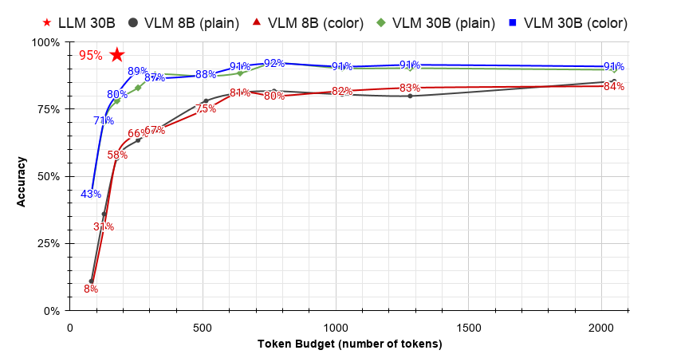

# txt2img

Snapshot code scripts into images for Vision-Language Models (VLMs) to
evaluate **text-as-image** as an alternative representation for coding tasks.

## Overview

Large Language Models (LLMs) process source code as text tokens, which can
become computationally expensive for long files. Recent work suggests
that representing text as images allows VLMs to
process significantly more information with fewer visual tokens while
maintaining competitive performance.

This project investigates **text-as-image** for programming tasks by
converting source code into images and evaluating
multimodal models on two coding benchmarks, HumanEval and DebugBench.

The repository contains both the image generation pipeline and the
experimental framework used to compare image-based and text-based code
representations.


## Features

-   Convert source code into high-resolution images
-   Adjustable image resolution and syntax highlighting themes
-   Batch processing for large benchmark datasets
-   Supports experiments on token compression and inference efficiency


## Research Questions

With the **text-as-image** technique, Modern LLMs have been proved to be more token-efficient in processing long text and prose. This project study whether the same technique can be applied to coding tasks to achieve a similar efficiency boost in input token cost. Two benchmarks on code generating (HumanEval) and code debugging (DebugEval) are performed in hope to answer the following questions.

-   Are visual input tokens more efficient than text tokens in processing coding tasks while matching similar accuracy?
-   How well do visual input tokens preserve programming syntax and semantics?
-   Does visual effect in images, such as coloring and font, affect the benchmark performances?

Evaluation metrics include:

-   Pass rate of generated codes
-   Debugging accuracy
-   Token budget comparison & compression ratio


## Experimental Pipeline

``` text
Coding Scripts/Tasks
      │
      ▼
Syntax Highlighting
      │
      ▼
HTML Rendering
      │
      ▼
PNG Code Snapshot
      │
      ▼
Vision-Language Model
      │
      ▼
Coding Tasks & Debug
```


## Setup

``` bash
git clone https://github.com/kchang3209/txt2img.git
git clone https://github.com/kchang3209/DebugEval.git
cd txt2img
bash scripts/install.sh
```

## Model Download
This projects uses the Qwen3 family models. The Coder variant is selected as the text-based LLM model and the VL variant as the VLM model. Both models have 30B parameters, which require a minimum of 60GB VRAM. The recommended hardware is at least one A100.

**LLM - Qwen3-Coder-30B-A3B-Instruct**

``` bash
bash scripts/download_model_llm.sh
```
**VLM - Qwen3-VL-30B-A3B-Instruct**
``` bash
bash scripts/download_model_vlm.sh
```

## Usage

**HumanEval Benchmark**
``` bash
# LLM
bash scripts/run_HumanEval_llm.sh

# VLM w/ Syntax Highlighting
bash scripts/run_HumanEval_vlm_color.sh

# VLM w/ Plain Code
bash scripts/run_HumanEval_vlm_plain.sh
```

**DebugEval Benchmark**
``` bash
# LLM
bash scripts/run_DebugEval_llm.sh

# VLM
bash scripts/run_DebugEval_vlm.sh
```


## Analysis




## Acknowledgements

This is an individual project developed under the instructions of Professor José Renau and Professor Yuyin Zhou.

Many thanks to several outstanding open-source resources:
- [**HumanEval**](https://github.com/openai/human-eval): Benchmark dataset for evaluating code generation and debugging tasks.
- [**COAST_DebugEval**](https://github.com/NEUIR/COAST): Evaluation framework adapted and extended for multimodal code understanding experiments.
- [**Qwen**](https://huggingface.co/collections/Qwen/qwen3-vl): Large Language Models and Vision-Language Models used throughout the experiments.

